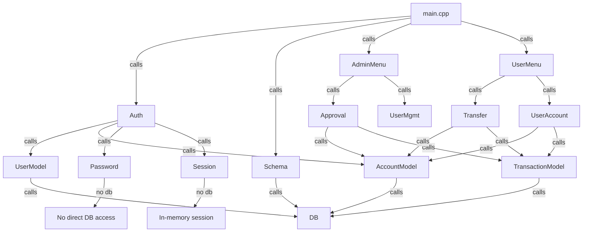
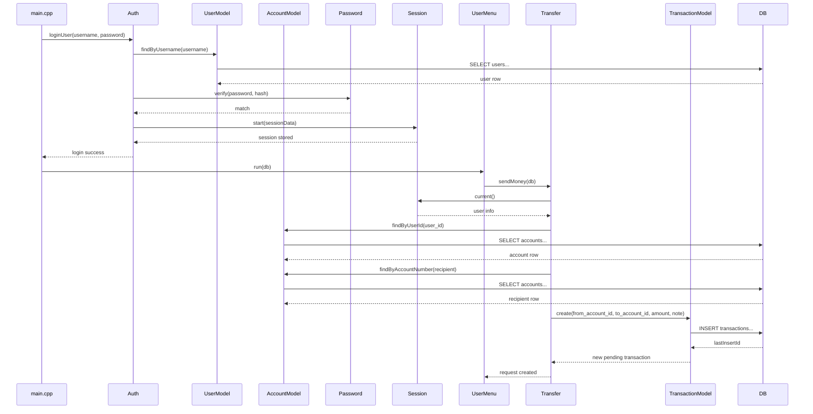
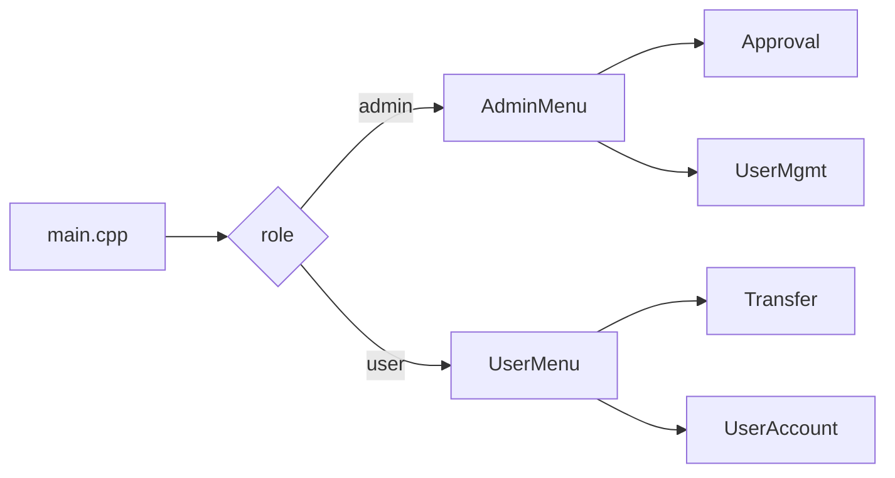

# API Reference

This document explains every application API and module in the Banking Management System. It describes what each API does, why it exists, how it is used, and how the parts connect in the final program.

## Table of Contents

1. [Overview](#overview)
2. [Component connections](#component-connections)
3. [Database Layer](#database-layer)
   1. [DB wrapper API](#db-wrapper-api)
   2. [Schema initialization API](#schema-initialization-api)
4. [Model Layer](#model-layer)
   1. [UserModel API](#usermodel-api)
   2. [AccountModel API](#accountmodel-api)
   3. [TransactionModel API](#transactionmodel-api)
5. [Authentication Layer](#authentication-layer)
   1. [Auth API](#auth-api)
   2. [Password API](#password-api)
   3. [Session API](#session-api)
6. [User Feature Layer](#user-feature-layer)
   1. [User menu API](#user-menu-api)
   2. [Transfer API](#transfer-api)
   3. [User account API](#user-account-api)
7. [Admin Feature Layer](#admin-feature-layer)
   1. [Admin menu API](#admin-menu-api)
   2. [Approval API](#approval-api)
   3. [User management API](#user-management-api)
8. [Data and transaction flow](#data-and-transaction-flow)
9. [Why each API exists](#why-each-api-exists)
10. [Important implementation details](#important-implementation-details)

---

## Overview

The Banking Management System is a C++ console application that uses a single SQLite database file (`banking.db`) for persistence. The application is intentionally layered:

- presentation layer: command-line menus and UI logic
- authentication/session layer: login, registration, and session state
- model layer: CRUD operations and data mapping
- database layer: raw SQLite wrapper and schema initialization

The code is organized into `src/` and `include/` directories. The `docs/api-reference.md` file describes the public API of each module, how components call each other, and the reason each API is needed.

This document is aimed at developers who need to understand the code structure, extend the system, or maintain the design.

---

## Component connections

The system is organized into clearly separated component groups. Each component has a well-defined responsibility and communicates with adjacent layers using narrow APIs.

### High-level component interaction

### Component connection narrative

- `main.cpp` is the program entrypoint. It creates the shared `DB` object and calls `Schema::init(db)` before any interaction.
- `main.cpp` also drives the login/register menu. It calls `Auth::loginUser` and `Auth::registerUser` during authentication.
- `Auth` is the gateway for user creation and login. It calls:
  - `UserModel` to read or create users,
  - `AccountModel` to create the account for a new user,
  - `Password` to hash or verify credentials,
  - `Session` to start the logged-in session.
- After login, `main.cpp` chooses either `AdminMenu::run(db)` or `UserMenu::run(db)` based on `Session::current().role`.
- `UserMenu` provides regular user actions and calls:
  - `Transfer::sendMoney(db)` for sending money requests,
  - `UserAccount::showBalanceAndHistory(db)` for reading account state.
- `AdminMenu` provides administrative actions and calls:
  - `Approval` for pending transaction review,
  - `UserMgmt` for user and account reporting.
- `Approval` needs to mutate two accounts atomically, so it calls:
  - `AccountModel::updateBalance`,
  - `TransactionModel::updateStatus`.
- `Transfer` models a user request. It reads the sender and recipient accounts, then creates a pending transaction.
- `UserAccount` reads the logged-in user’s account and transaction history for display.
- The models `UserModel`, `AccountModel`, and `TransactionModel` are the only code that interacts directly with `DB`.
- `Password` and `Session` are intentionally isolated from the database layer: `Password` handles hashing, and `Session` handles runtime in-memory state.

### Physical code connections

Component call graph by file and namespace:

- `src/main.cpp` → `Auth::loginUser`, `Auth::registerUser`, `Schema::init`, `AdminMenu::run`, `UserMenu::run`
- `src/auth/auth.cpp` → `UserModel`, `AccountModel`, `Password`, `Session`
- `src/auth/session.cpp` → in-memory session state only
- `src/user/user_menu.cpp` → `Transfer::sendMoney`, `UserAccount::showBalanceAndHistory`
- `src/user/transfer.cpp` → `AccountModel`, `TransactionModel`, `Session`
- `src/user/user_account.cpp` → `AccountModel`, `TransactionModel`, `Session`
- `src/admin/admin_menu.cpp` → `Approval`, `UserMgmt`
- `src/admin/approval.cpp` → `AccountModel`, `TransactionModel`, `Session`
- `src/admin/user_mgmt.cpp` → `UserModel`, `AccountModel`
- `src/models/*.cpp` → `DB` wrapper APIs
- `src/database/schema.cpp` → `DB` wrapper APIs

### Mermaid sequence diagram for a login and transfer request

### Mermaid choice diagram for admin vs user path

---

## Database Layer

The database layer exposes the lowest-level API used across the entire repository. It exists so higher-level code does not call `sqlite3_*` directly.

### DB wrapper API

Defined in:
- `include/database/db.h`
- `src/database/db.cpp`

Purpose:
- centralize SQLite initialization and cleanup
- provide safe parameterized query execution
- reduce duplication of `sqlite3_prepare_v2`, `sqlite3_step`, `sqlite3_finalize`
- store a single persistent database connection for the lifetime of the program

Public API:

- `DB(const std::string& path)`
  - Opens the SQLite file at `path`.
  - Enables `PRAGMA foreign_keys = ON` to enforce referential integrity.
  - Enables `PRAGMA journal_mode = WAL` to use write-ahead logging for safer commit behavior.

- `~DB()`
  - Closes the SQLite database connection cleanly.

- `void execute(const std::string& sql)`
  - Executes SQL statements that do not require parameter binding, such as table creation.
  - Uses `sqlite3_exec` internally.

- `void execute(const std::string& sql, BindFn binder)`
  - Executes a SQL statement with bound parameters.
  - Prepares the SQL, calls the lambda `binder(sqlite3_stmt*)` to bind values, steps once, and finalizes.
  - Used for inserts, updates, and single-row writes.

- `std::vector<Row> query(const std::string& sql)`
  - Runs a SELECT query without parameters and returns all result rows.
  - Each `Row` is a `std::map<std::string, std::string>` of column names to values.

- `std::vector<Row> query(const std::string& sql, BindFn binder)`
  - Runs a SELECT query with bound parameters, returning all result rows.

- `int64_t lastInsertId() const`
  - Returns the last automatically generated row ID.
  - Used after `INSERT` to load the newly created record.

Why it exists:
- the raw SQLite C API is verbose and error-prone.
- this wrapper enforces consistent error handling and prevents repeated binding/stepping boilerplate.
- all other modules can use a typed, narrow interface instead of SQLite internals.

### Schema initialization API

Defined in:
- `include/database/schema.h`
- `src/database/schema.cpp`

Purpose:
- create the required database tables when the application starts
- enforce initial structure before any business logic runs
- seed the default admin account if no admin exists
- perform simple data cleanup on startup

Public API:

- `void Schema::init(DB& db)`
  - Creates the `users`, `accounts`, and `transactions` tables if they do not exist.
  - Ensures `created_at` defaults to `datetime('now')` in SQL.
  - Ensures `accounts.balance` is not null and seeds it if necessary.
  - Creates the admin user record if no admin exists.

Why it exists:
- the system must be runnable from a clean checkout.
- schema creation is one-time startup infrastructure, not business logic.
- keeping it isolated prevents schema code from being scattered across feature modules.

---

## Model Layer

The model layer maps database rows into plain C++ structs and provides CRUD-style methods.
Models are intentionally simple: they do not implement business rules.
They exist so the application logic can operate in terms of domain objects instead of raw SQL.

### UserModel API

Defined in:
- `include/models/user.h`
- `src/models/user.cpp`

Struct:

- `User`
  - `int id`
  - `std::string name`
  - `std::string username`
  - `std::string password_hash`
  - `std::string role` (`"user"` or `"admin"`)
  - `std::string created_at`

Public API:

- `std::optional<User> UserModel::findById(DB& db, int id)`
  - Finds a user by numeric ID.
  - Returns empty when no matching user exists.

- `std::optional<User> UserModel::findByUsername(DB& db, const std::string& username)`
  - Finds a user by username.
  - Used during login and registration checks.

- `User UserModel::create(DB& db, const std::string& name, const std::string& username, const std::string& password_hash, const std::string& role)`
  - Inserts a new user row with a hashed password and role.
  - Returns the created `User` object.

- `std::vector<User> UserModel::findAll(DB& db)`
  - Returns all users in the system.
  - Used by admin user management.

Why it exists:
- centralizes SQL for `users` so other code never duplicates the same SELECT or INSERT.
- makes it easy to change the user table schema in one place.
- returns typed domain objects instead of raw row maps.

### AccountModel API

Defined in:
- `include/models/account.h`
- `src/models/account.cpp`

Struct:

- `Account`
  - `int id`
  - `int user_id`
  - `std::string account_number`
  - `double balance`
  - `std::string created_at`

Public API:

- `Account AccountModel::create(DB& db, int user_id)`
  - Generates an account number from the user ID.
  - Inserts a new account with a default balance of `500.0`.
  - Returns the newly created account.

- `std::optional<Account> AccountModel::findByUserId(DB& db, int user_id)`
  - Finds the single account that belongs to a given user.
  - A regular user always has one account.

- `std::optional<Account> AccountModel::findByAccountNumber(DB& db, const std::string& account_number)`
  - Finds an account by its public account number string.
  - Used when a user provides a recipient account number.

- `bool AccountModel::updateBalance(DB& db, int account_id, double new_balance)`
  - Updates the balance for an account row.
  - Returns `true` on success.

- `std::vector<Account> AccountModel::findAll(DB& db)`
  - Returns all account rows.
  - Used by admin reports.

Why it exists:
- isolates account-related SQL and number generation.
- allows the rest of the app to reason in terms of `Account` objects.
- encapsulates balance updates in one place so approval code is simpler.

### TransactionModel API

Defined in:
- `include/models/transaction.h`
- `src/models/transaction.cpp`

Struct:

- `Transaction`
  - `int id`
  - `int from_account_id`
  - `int to_account_id`
  - `double amount`
  - `std::string status` (`"pending"`, `"approved"`, or `"rejected"`)
  - `std::string note`
  - `std::string created_at`
  - `int reviewed_by`
  - `std::string reviewed_at`

Public API:

- `Transaction TransactionModel::create(DB& db, int from_account_id, int to_account_id, double amount, const std::string& note = "")`
  - Inserts a transaction row with status `pending`.
  - Returns the inserted transaction.

- `std::vector<Transaction> TransactionModel::findPending(DB& db)`
  - Returns all transactions whose status is `pending`.
  - Used by admins to review transfers.

- `std::vector<Transaction> TransactionModel::findByAccountId(DB& db, int account_id)`
  - Returns all transactions where the account is the sender or recipient.
  - Used to show account transaction history.

- `bool TransactionModel::updateStatus(DB& db, int txn_id, const std::string& status, int reviewed_by)`
  - Updates the transaction status to `approved` or `rejected`.
  - Sets `reviewed_by` and `reviewed_at`.

Why it exists:
- transaction semantics are central to the application.
- the model ensures there is one source of truth for pending/approved/rejected logic.
- approval and user history code can rely on consistent transaction objects.

---

## Authentication Layer

The authentication layer handles login and registration and ties application sessions to database users.
It exists to validate credentials, create new accounts, and track the currently logged-in user.

### Auth API

Defined in:
- `include/auth/auth.h`
- `src/auth/auth.cpp`

Public API:

- `bool Auth::registerUser(DB& db, const std::string& name, const std::string& username, const std::string& password)`
  - Validates that `username` is not empty.
  - Ensures the username is not already taken using `UserModel::findByUsername`.
  - Hashes the password using `Password::hash`.
  - Creates a new `User` row with `UserModel::create(..., role="user")`.
  - Creates a new account row with `AccountModel::create(db, user.id)`.
  - Prints registration confirmation and account number.

- `bool Auth::loginUser(DB& db, const std::string& username, const std::string& password)`
  - Finds the user with `UserModel::findByUsername`.
  - Verifies the password with `Password::verify`.
  - For admin users, checks a fallback hardcoded password if needed.
  - Starts the session by calling `Session::start` with `SessionData`.
  - Returns `true` when login succeeds, otherwise `false`.

Why it exists:
- centralizes registration and login business logic.
- prevents login checks from being duplicated in `main.cpp`.
- ensures user creation always creates an account.
- isolates password hashing from menu logic.

### Password API

Defined in:
- `include/auth/password.h`
- `src/auth/password.cpp`

Purpose:
- encapsulates password hashing and verification.
- avoids storing plain-text passwords in the database.
- provides a standardized authentication contract for the rest of the system.

Public API:
- `std::string Password::hash(const std::string& plain)`
- `bool Password::verify(const std::string& plain, const std::string& stored_hash)`

Why it exists:
- security: passwords must be hashed before persistence.
- separation: auth logic can call a small, deterministic helper.
- future-proofing: if hashing changes, only `Password` needs modification.

### Session API

Defined in:
- `include/auth/session.h`
- `src/auth/session.cpp`

Purpose:
- store the currently logged-in user's identity and role in memory.
- allow menu and feature code to verify permissions.
- hide session state behind a simple API rather than global variables.

Struct:
- `SessionData` contains:
  - `int user_id`
  - `std::string username`
  - `std::string role`
  - `int account_id`

Public API:
- `void Session::start(const SessionData& data)`
  - activates the session
- `void Session::end()`
  - logs the user out
- `bool Session::isLoggedIn()`
  - reports whether a session exists
- `SessionData Session::current()`
  - returns the active session data
  - may throw if no one is logged in

Why it exists:
- the app is not web-based, so there is no request-session model.
- session state still matters inside the running console application.
- features can query the current user without threading or complex context passing.

---

## User Feature Layer

The user feature layer implements the regular user workflows.
These APIs are the only code paths used after a non-admin login.

### User menu API

Defined in:
- `include/user/user_menu.h`
- `src/user/user_menu.cpp`

Purpose:
- display the regular user menu
- route user input to the correct feature
- maintain a menu loop until logout

Public API:
- `void UserMenu::run(DB& db)`
  - prints:
    - `1. View Balance & Transaction History`
    - `2. Send Money`
    - `3. Logout`
  - handles input and calls `UserAccount::showBalanceAndHistory` or `Transfer::sendMoney`
  - calls `Session::end()` on logout

Why it exists:
- encapsulates user-facing console interaction separately from business rules.
- keeps `main.cpp` focused on login routing only.

### Transfer API

Defined in:
- `include/user/transfer.h`
- `src/user/transfer.cpp`

Purpose:
- implement the send-money workflow for users.
- validate the transfer input.
- create a pending transaction rather than immediately changing balances.

Public API:
- `void Transfer::sendMoney(DB& db)`
  - reads the current user session via `Session::current()`
  - loads the sender account using `AccountModel::findByUserId`
  - prompts for recipient account number, amount, and optional note
  - validates:
    - recipient account exists
    - the sender is not sending to themselves
    - amount is positive
    - sender balance is sufficient for the request
  - creates a pending transaction row using `TransactionModel::create`
  - prints a confirmation with the pending transaction ID

Why it exists:
- separates user input validation from transaction creation.
- enforces the business rule that user transfers require admin approval.
- keeps transfer logic from being duplicated in menu code.

### User account API

Defined in:
- `include/user/user_account.h`
- `src/user/user_account.cpp`

Purpose:
- display the current user's account balance and full transaction history.
- provide a read-only view of the user’s personal financial data.

Public API:
- `void UserAccount::showBalanceAndHistory(DB& db)`
  - loads the current user session
  - fetches the user’s account via `AccountModel::findByUserId`
  - prints the account number and balance
  - calls `TransactionModel::findByAccountId` to read every transaction where the account is sender or receiver
  - prints transactions in descending order of date

Why it exists:
- centralizes the account history display logic.
- avoids mixing query code with menu presentation.
- ensures the account history view is consistent across the application.

---

## Admin Feature Layer

The admin feature layer implements approval and system oversight actions.
These APIs are used only after an admin login.

### Admin menu API

Defined in:
- `include/admin/admin_menu.h`
- `src/admin/admin_menu.cpp`

Purpose:
- display the admin menu
- route admin choices to approval and user management workflows
- manage logout

Public API:
- `void AdminMenu::run(DB& db)`
  - prints:
    - `1. View Pending Transactions`
    - `2. Approve / Reject a Transaction`
    - `3. View All Users & Accounts`
    - `4. Logout`
  - calls `Approval::listPending`, `Approval::reviewTransaction`, or `UserMgmt::listAllUsers`
  - calls `Session::end()` on logout

Why it exists:
- isolates admin console navigation.
- keeps admin-specific UI separate from the user menu.
- prevents menu complexity from leaking into approval or user management code.

### Approval API

Defined in:
- `include/admin/approval.h`
- `src/admin/approval.cpp`

Purpose:
- show pending transactions to the admin
- approve or reject transfer requests
- enforce atomic balance updates on approval

Public API:
- `void Approval::listPending(DB& db)`
  - loads pending transactions using `TransactionModel::findPending`
  - prints each pending row with transaction ID, sender, receiver, amount, note, and creation timestamp

- `void Approval::reviewTransaction(DB& db)`
  - prompts the admin for a transaction ID
  - loads the pending transaction details
  - asks the admin to approve, reject, or cancel
  - if approved:
    - validates the sender still has enough balance
    - updates the sender and receiver account balances using `AccountModel::updateBalance`
    - updates the transaction status using `TransactionModel::updateStatus`
    - executes the balance updates and status update inside a `BEGIN` / `COMMIT` transaction
  - if rejected:
    - updates transaction status to `rejected`
    - records `reviewed_by` and `reviewed_at`

- `void Approval::transferFunds(DB& db)`
  - allows the admin to transfer funds directly between any two accounts
  - also performs the operation inside a database transaction
  - useful for correction, adjustment, or demonstration purposes

Why it exists:
- implements the core approval business rule of the system.
- provides a safe mechanism to mutate two account balances and a transaction row together.
- separates approval policy from data persistence.

### User management API

Defined in:
- `include/admin/user_mgmt.h`
- `src/admin/user_mgmt.cpp`

Purpose:
- show a complete list of users and their associated account details
- provide admin visibility into system state

Public API:
- `void UserMgmt::listAllUsers(DB& db)`
  - loads all users with `UserModel::findAll`
  - for each non-admin user, loads the account via `AccountModel::findByUserId`
  - prints a table of user ID, name, username, account number, balance, and joined date

Why it exists:
- gives admin an audit view of registered users.
- avoids ad hoc SELECT queries in menu code.
- keeps the reporting operation self-contained.

---

## Data and transaction flow

This section describes how the APIs are composed during normal app execution.

### Application startup

1. `main.cpp` constructs `DB db("banking.db")`.
2. `main.cpp` calls `Schema::init(db)`.
3. Schema initialization creates tables and seeds the default admin if needed.
4. `main.cpp` enters the login/register loop.

### Registration flow

1. User selects Register in `main.cpp`.
2. `main.cpp` reads name, username, password.
3. `main.cpp` calls `Auth::registerUser(db, name, username, password)`.
4. `Auth::registerUser` verifies the username does not exist using `UserModel::findByUsername`.
5. Password is hashed via `Password::hash`.
6. `UserModel::create` inserts a new user row.
7. `AccountModel::create` inserts a new account row with a default balance.
8. Registration returns to `main.cpp`.

### Login flow

1. User selects Login in `main.cpp`.
2. `main.cpp` reads username and password.
3. `main.cpp` calls `Auth::loginUser(db, username, password)`.
4. `Auth::loginUser` loads the user via `UserModel::findByUsername`.
5. Password is verified with `Password::verify`.
6. On success, `Session::start` stores the session data.
7. `main.cpp` inspects `Session::current().role`.
8. Admins go to `AdminMenu::run(db)`, users go to `UserMenu::run(db)`.

### User transfer flow

1. User selects Send Money from `UserMenu::run`.
2. `Transfer::sendMoney(db)` loads sender account using `AccountModel::findByUserId`.
3. It reads recipient account number, amount, note.
4. It validates recipient existence and available balance.
5. `TransactionModel::create` inserts a `pending` transaction.
6. The request appears in admin pending queue.

### Admin review flow

1. Admin selects Approve / Reject Transaction from `AdminMenu::run`.
2. `Approval::reviewTransaction(db)` lists pending transactions.
3. Admin chooses a transaction ID.
4. If approved, the app:
   - loads both sender and receiver accounts
   - deducts sender balance and credits receiver balance
   - updates the transaction status to `approved`
   - stores the admin ID in `reviewed_by`
   - records `reviewed_at`
   - commits all changes atomically using SQLite transaction statements
5. If rejected, the app marks the transaction `rejected` and records review metadata.

### History and reporting flow

- `UserAccount::showBalanceAndHistory(db)` reads account history for the current user.
- `UserMgmt::listAllUsers(db)` reads all users and accounts for admin oversight.
- `Approval::listPending(db)` reads all pending transactions.

---

## Why each API exists

### Database API
- prevents raw SQLite from leaking into business code.
- standardizes error handling and cleanup.
- allows future database changes to be localized.

### Schema API
- ensures the application is runnable without manual database creation.
- keeps schema definition separate from runtime logic.

### Model APIs
- `UserModel`, `AccountModel`, and `TransactionModel` all exist because the application needs a stable translation layer between SQL and C++ objects.
- they prevent SQL duplication.
- they make business code easier to read, test, and maintain.

### Auth + Session APIs
- registration and login are cross-cutting concerns used by every run of the app.
- these APIs isolate credential validation and session state management from menus.
- they make it easy to add authorization checks later.

### User & Admin APIs
- user features and admin features have separate menus because they represent different roles and permissions.
- this separation makes it easy to audit who can perform which actions.
- it also keeps each menu loop focused on its own responsibilities.

---

## Important implementation details

### Single DB connection

`DB db("banking.db")` is created once in `main.cpp` and passed by reference to all modules.
This means the system is not designed for concurrent multi-process or multi-threaded access in the same runtime.

### Transactional approval

`Approval::reviewTransaction` is the only place where the app updates two account balances and one transaction status together.
It uses explicit SQL transaction boundaries (`BEGIN`, `COMMIT`) to keep the system consistent.

### Pending transaction model

The app intentionally does not change balances when a user submits money.
`TransactionModel::create` creates a `pending` transaction, and only admin approval moves money.
This is the core business rule of the system.

### Admin seed behavior

`Schema::init` creates the default admin account automatically on first startup.
This avoids a separate setup step and ensures the system is manageable immediately.

### Separation of concerns

Each layer has a clear responsibility:
- `main.cpp`: program entry and login routing
- `auth/`: credentials and session state
- `models/`: SQL data access
- `database/`: low-level SQLite wrapper
- `user/`, `admin/`: role-specific features

---

## Key file references

- `src/main.cpp` — program entry point, login/register routing
- `src/database/db.cpp` — SQLite wrapper implementation
- `src/database/schema.cpp` — table creation and admin seeding
- `src/models/user.cpp` — user CRUD API
- `src/models/account.cpp` — account CRUD API
- `src/models/transaction.cpp` — transaction CRUD API
- `src/auth/auth.cpp` — registration and login behavior
- `src/auth/session.cpp` — in-memory session handling
- `src/user/transfer.cpp` — send money workflow
- `src/user/user_account.cpp` — user account balance and history view
- `src/admin/approval.cpp` — approve/reject transaction workflow
- `src/admin/user_mgmt.cpp` — admin user/account list view

---

## Recommended extension points

If the system is extended later, these are the best places to add new APIs:

- new business rules: add methods to `models/` and call them from `auth/`, `user/`, or `admin/`
- new persistence features: extend `database/db.h` if another SQL backend is needed
- new security or roles: add role checks in `Session::current()` and in menu routing
- new reporting screens: add functions under `admin/` and keep the menu loop in `AdminMenu::run`

---

This API reference is intended to be the canonical developer guide for the Banking Management System. Use it when changing database structure, authentication, or approval workflows.
