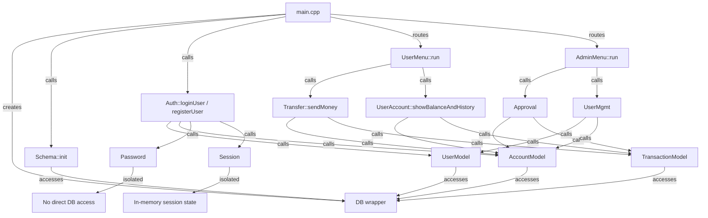

# Working Architecture and Component Connections

This file explains how every component in the Banking Management System connects to the others and how each part works. It is written to help developers understand the application flow, the boundaries between modules, and the data paths through the system.

## Table of Contents

1. [High-level Overview](#high-level-overview)
2. [Component Layers](#component-layers)
3. [Component Connection Diagram](#component-connection-diagram)
4. [Detailed Component Responsibilities](#detailed-component-responsibilities)
   1. [main.cpp](#maincpp)
   2. [Database Layer](#database-layer)
   3. [Schema Initialization](#schema-initialization)
   4. [Model Layer](#model-layer)
      1. [UserModel](#usermodel)
      2. [AccountModel](#accountmodel)
      3. [TransactionModel](#transactionmodel)
   5. [Authentication Layer](#authentication-layer)
      1. [Auth::registerUser](#authregisteruser)
      2. [Auth::loginUser](#authloginuser)
      3. [Password API](#password-api)
   6. [Session Layer](#session-layer)
   7. [User Feature Layer](#user-feature-layer)
      1. [UserMenu](#usermenu)
      2. [Transfer](#transfer)
      3. [UserAccount](#useraccount)
   8. [Admin Feature Layer](#admin-feature-layer)
      1. [AdminMenu](#adminmenu)
      2. [Approval](#approval)
      3. [UserMgmt](#usermgmt)
5. [Example flows](#example-flows)
   1. [Registration flow](#registration-flow)
   2. [Login flow](#login-flow)
   3. [User transfer flow](#user-transfer-flow)
   4. [Admin approval flow](#admin-approval-flow)
6. [Why the connections are structured this way](#why-the-connections-are-structured-this-way)

---

## High-level Overview

The Banking Management System is a C++ console application that manages users, accounts, and money transfer approvals using a single SQLite database file.

The system is built as a layered architecture so responsibilities are separated and dependencies remain clear.

Directory responsibilities:

- `src/main.cpp` handles startup, login/register, and role routing.
- `database/` holds the SQLite wrapper and schema setup.
- `models/` maps database tables to typed objects and CRUD operations.
- `auth/` handles login, registration, password hashing, and session state.
- `user/` handles regular user features like sending money and viewing history.
- `admin/` handles admin features like reviewing transactions and listing users.

Shared resources:

- one `DB` instance is created in `main.cpp`.
- `Schema::init(db)` initializes the database schema.
- `Session::start` stores the active user session in memory.

---

## Component Layers

The application is divided into four layers:

1. Presentation layer
   - `main.cpp`
   - `user/user_menu.cpp`
   - `admin/admin_menu.cpp`
2. Authentication/session layer
   - `auth/auth.cpp`
   - `auth/password.cpp`
   - `auth/session.cpp`
3. Model layer
   - `models/user.cpp`
   - `models/account.cpp`
   - `models/transaction.cpp`
4. Database layer
   - `database/db.cpp`
   - `database/schema.cpp`

Each layer depends only on the layer directly beneath it, ensuring a clean flow and minimizing coupling.

---

## Component Connection Diagram

---

## Detailed component responsibilities

### main.cpp

File: `src/main.cpp`

Main responsibility:
- start the application,
- initialize the shared database,
- run schema setup,
- coordinate authentication,
- and route users to the correct menu.

Behavior:
- instantiate `DB db("banking.db")`.
- call `Schema::init(db)`.
- print the first menu with `Login`, `Register`, and `Exit`.
- read input with `std::getline` and sanitize via `trim()`.
- if the user chooses `Login`, call `Auth::loginUser(db, username, password)`.
- if the user chooses `Register`, call `Auth::registerUser(db, name, username, password)`.
- after login, read `Session::current().role`.
- if role is `admin`, call `AdminMenu::run(db)`.
- if role is `user`, call `UserMenu::run(db)`.

Why it exists:
- it centralizes startup and user routing.
- it avoids scattering login and registration logic across the codebase.
- it ensures a single `DB` connection is shared by all components.

Important detail:
- `main.cpp` does not execute SQL directly.
- it does not manipulate passwords or account records itself.
- it only calls higher-level APIs.

### Database Layer

Files:
- `include/database/db.h`
- `src/database/db.cpp`

Main responsibility:
- wrap `sqlite3` for the rest of the system.
- manage connection lifetime.
- expose query and execute methods.

Operations:
- `DB(const std::string& path)`
  - open the database file
  - set `PRAGMA foreign_keys = ON`
  - set `PRAGMA journal_mode = WAL`
- `~DB()`
  - close the connection
- `void execute(const std::string& sql)`
  - execute statements without parameters
- `void execute(const std::string& sql, BindFn binder)`
  - execute statements with parameter binding
- `std::vector<Row> query(const std::string& sql)`
  - run a SELECT with no bindings
- `std::vector<Row> query(const std::string& sql, BindFn binder)`
  - run a SELECT with bindings
- `int64_t lastInsertId() const`
  - return the last auto-generated ID

Why it exists:
- it prevents SQLite boilerplate from appearing in all modules.
- it provides a consistent and safer API.
- it keeps the connection object explicit.

Important detail:
- `Row` is a map of column names to string values.
- `DB` is passed by reference; no global database object exists.
- it is the only layer that includes `sqlite3.h`.

### Schema Initialization

Files:
- `include/database/schema.h`
- `src/database/schema.cpp`

Main responsibility:
- create the database schema if missing.
- seed the initial admin user.

Behavior:
- create `users`, `accounts`, and `transactions` tables using `CREATE TABLE IF NOT EXISTS`.
- seed default admin credentials if no admin exists.
- ensure account balances are valid.

Why it exists:
- the system needs to be runnable from a clean checkout.
- schema creation is infrastructure, not business logic.
- isolating schema setup improves maintainability.

Important detail:
- it creates the admin account automatically.
- it does not participate in runtime business logic.

### Model Layer

The model layer is the only layer that communicates directly with `DB` for CRUD operations.
It converts between raw database rows and typed C++ objects.

#### UserModel

Files:
- `include/models/user.h`
- `src/models/user.cpp`

Main responsibility:
- manage the `users` table.
- provide typed user objects.

API:
- `findById(db, id)`
- `findByUsername(db, username)`
- `create(db, name, username, password_hash, role)`
- `findAll(db)`

Why it exists:
- to keep user SQL in one place.
- to make auth and admin code simpler.
- to ensure consistent user object construction.

Important detail:
- `password_hash` is stored by this layer, not in `Auth`.
- the user object contains `role` so authorization checks are straightforward.

#### AccountModel

Files:
- `include/models/account.h`
- `src/models/account.cpp`

Main responsibility:
- manage the `accounts` table.
- provide account creation, lookup, and balance update operations.

API:
- `create(db, user_id)`
- `findByUserId(db, user_id)`
- `findByAccountNumber(db, account_number)`
- `updateBalance(db, account_id, new_balance)`
- `findAll(db)`

Why it exists:
- to centralize account number generation.
- to keep balance updates out of higher-level code.
- to support both user and admin flows.

Important detail:
- new accounts start with a default balance.
- only `Approval` and admin transfer logic should change balances directly.

#### TransactionModel

Files:
- `include/models/transaction.h`
- `src/models/transaction.cpp`

Main responsibility:
- manage the `transactions` table.
- represent transfer requests and approval state.

API:
- `create(db, from_account_id, to_account_id, amount, note)`
- `findPending(db)`
- `findByAccountId(db, account_id)`
- `updateStatus(db, txn_id, status, reviewed_by)`

Why it exists:
- to model money movement as pending intent.
- to isolate transaction state transitions.
- to provide consistent history views.

Important detail:
- a transaction is not money movement until approved.
- it captures both the amount and reviewer metadata.

### Authentication Layer

Files:
- `include/auth/auth.h`
- `src/auth/auth.cpp`
- `include/auth/password.h`
- `src/auth/password.cpp`

Main responsibility:
- register users,
- log users in,
- hash passwords,
- and create sessions.

#### Auth::registerUser

Purpose:
- handle new user registration fully.
- create both a user record and an account record.

Step-by-step:
1. check for an existing username with `UserModel::findByUsername`.
2. if the username exists, fail registration.
3. hash the password with `Password::hash`.
4. create the user with `UserModel::create`.
5. create the account with `AccountModel::create`.
6. print success and account details.

Why it exists:
- to keep registration atomic and centralized.
- to hide password hashing from menu code.
- to ensure every user gets an account.

Important detail:
- it never writes unencrypted passwords.
- it is the only route that creates new user and account pairs.

#### Auth::loginUser

Purpose:
- authenticate credentials and start a session.

Step-by-step:
1. load the user with `UserModel::findByUsername`.
2. if missing, return false.
3. verify password with `Password::verify`.
4. if verification fails, return false.
5. construct `SessionData` with user and account info.
6. call `Session::start(sessionData)`.
7. return true.

Why it exists:
- to isolate login policies.
- to ensure only valid users create sessions.
- to decouple UI from authentication logic.

Important detail:
- it uses the stored hashed password.
- it does not access `DB` directly, only through `UserModel`.

#### Password API

Files:
- `include/auth/password.h`
- `src/auth/password.cpp`

Purpose:
- hash plain text passwords.
- verify password input against stored hashes.

Methods:
- `Password::hash(const std::string& plain)`
- `Password::verify(const std::string& plain, const std::string& stored_hash)`

Why it exists:
- to separate cryptographic concerns from auth.
- to allow secure password handling without exposing the implementation.

Important detail:
- `Password` does not write to the database.
- it only transforms and verifies strings.

### Session Layer

Files:
- `include/auth/session.h`
- `src/auth/session.cpp`

Purpose:
- maintain current logged-in user state.
- expose user identity and role to the entire app.

State:
- `SessionData { user_id, username, role, account_id }`

Public methods:
- `Session::start(const SessionData& data)`
- `Session::end()`
- `Session::isLoggedIn()`
- `Session::current()`

Why it exists:
- to avoid passing user context through every function.
- to make authorization checks simple and centralized.

Important detail:
- session state is ephemeral and in memory only.
- it is independent of the database.

### User Feature Layer

This layer implements logged-in user functionality and is reached after `Auth::loginUser` succeeds for a regular user.

#### UserMenu

Files:
- `include/user/user_menu.h`
- `src/user/user_menu.cpp`

Purpose:
- present the user menu.
- route controls to user-specific features.

Flow:
- display options to view balance/history, send money, or logout.
- call `UserAccount::showBalanceAndHistory(db)` for balance and history.
- call `Transfer::sendMoney(db)` for money requests.
- call `Session::end()` to log out.

Why it exists:
- to keep the user interface separate from business logic.
- to make user actions explicit and easy to modify.

Important detail:
- it does not perform CRUD directly.
- it delegates to `user/` features.

#### Transfer

Files:
- `include/user/transfer.h`
- `src/user/transfer.cpp`

Purpose:
- handle user money transfer requests.
- validate input and create pending transactions.

Flow:
- fetch current user from `Session::current()`.
- read the sender account with `AccountModel::findByUserId(db, session.user_id)`.
- prompt the user for recipient account number.
- read recipient account with `AccountModel::findByAccountNumber(db, recipient_number)`.
- validate the recipient exists and is not the sender.
- prompt for amount and validate sufficient balance.
- optionally collect a note.
- call `TransactionModel::create(db, sender.id, recipient.id, amount, note)`.
- print confirmation with pending transaction ID.

Why it exists:
- to enforce the rule that user transfers remain pending until admin review.
- to separate validation from persistence.
- to keep UI and data logic cleanly divided.

Important detail:
- it writes only the transaction row, not account balances.
- it reliably preserves the request for later admin approval.

#### UserAccount

Files:
- `include/user/user_account.h`
- `src/user/user_account.cpp`

Purpose:
- show the current user's balance and transaction history.

Flow:
- fetch current user from `Session::current()`.
- load the user's account with `AccountModel::findByUserId(db, session.user_id)`.
- print the account number, balance, and creation date.
- call `TransactionModel::findByAccountId(db, account.id)`.
- print the transactions with status, sender, receiver, amount, and notes.

Why it exists:
- to provide a consistent account dashboard.
- to keep history rendering separate from queries.
- to ensure only current user data is shown.

Important detail:
- it never mutates state.
- it reads only the current user's account and transactions.

### Admin Feature Layer

This layer is reached only when the logged-in role is `admin`.
It centralizes approval and system reporting.

#### AdminMenu

Files:
- `include/admin/admin_menu.h`
- `src/admin/admin_menu.cpp`

Purpose:
- present admin controls.
- dispatch to admin workflows.

Flow:
- display pending transaction review, approve/reject, view all users, and logout.
- call `Approval::listPending(db)`.
- call `Approval::reviewTransaction(db)`.
- call `UserMgmt::listAllUsers(db)`.
- call `Session::end()` to log out.

Why it exists:
- to isolate admin UI from normal user UI.
- to make admin functionality easy to locate and extend.

Important detail:
- it does not perform the approval logic itself.
- it delegates to the `admin/` modules.

#### Approval

Files:
- `include/admin/approval.h`
- `src/admin/approval.cpp`

Purpose:
- manage pending transaction approval.
- ensure approved money movement is applied safely.

Flow:
- `Approval::listPending(db)` calls `TransactionModel::findPending(db)`.
- `Approval::reviewTransaction(db)` prompts for a transaction ID.
- it locates the selected transaction.
- it prompts for approve, reject, or cancel.
- if approved:
  - load sender and receiver accounts.
  - ensure sender has sufficient balance.
  - start a SQL transaction with `BEGIN`.
  - update sender balance with `AccountModel::updateBalance(db, sender.id, new_sender_balance)`.
  - update receiver balance with `AccountModel::updateBalance(db, receiver.id, new_receiver_balance)`.
  - call `TransactionModel::updateStatus(db, transaction.id, "approved", admin_id)`.
  - commit the SQL transaction.
- if rejected:
  - call `TransactionModel::updateStatus(db, transaction.id, "rejected", admin_id)`.
- if canceled:
  - return to the admin menu without updates.

Why it exists:
- to guarantee the transfer approval lifecycle is handled correctly.
- to prevent partial updates by using explicit transaction boundaries.
- to audit which admin reviewed each request.

Important detail:
- if approval fails mid-update, the SQL transaction prevents inconsistent state.
- the admin workflow is the only place that changes account balances due to transfers.

#### UserMgmt

Files:
- `include/admin/user_mgmt.h`
- `src/admin/user_mgmt.cpp`

Purpose:
- provide a complete view of all registered users and their accounts.
- support admin auditing.

Flow:
- call `UserModel::findAll(db)`.
- for each user, if they are not admin, call `AccountModel::findByUserId(db, user.id)`.
- print a table containing user ID, name, username, account number, balance, and join date.

Why it exists:
- to keep admin reporting separate from approval logic.
- to make the system audit-friendly.
- to avoid duplicating user reporting code in the menu.

Important detail:
- admin accounts may exist without a bank account.
- account lookup is per-user, because accounts are one-per-user.

---

## Example flows

### Registration flow

1. User selects Register in `main.cpp`.
2. `main.cpp` reads `name`, `username`, and `password`.
3. `main.cpp` calls `Auth::registerUser(db, name, username, password)`.
4. `Auth` calls `UserModel::findByUsername(db, username)`.
5. if the username already exists, registration fails.
6. `Auth` calls `Password::hash(password)`.
7. `Auth` calls `UserModel::create(db, name, username, password_hash, "user")`.
8. `Auth` calls `AccountModel::create(db, created_user.id)`.
9. `Auth` prints the account number.
10. control returns to `main.cpp`.

### Login flow

1. User selects Login in `main.cpp`.
2. `main.cpp` reads `username` and `password`.
3. `main.cpp` calls `Auth::loginUser(db, username, password)`.
4. `Auth` calls `UserModel::findByUsername(db, username)`.
5. if no user exists, login fails.
6. `Auth` calls `Password::verify(password, user.password_hash)`.
7. if verification succeeds, `Auth` calls `Session::start(session_data)`.
8. `main.cpp` reads `Session::current().role`.
9. `main.cpp` routes to `AdminMenu::run(db)` or `UserMenu::run(db)`.

### User transfer flow

1. The logged-in user selects Send Money in `UserMenu`.
2. `UserMenu` calls `Transfer::sendMoney(db)`.
3. `Transfer` calls `Session::current()` to get the current user.
4. `Transfer` loads sender account with `AccountModel::findByUserId(db, session.user_id)`.
5. `Transfer` requests a recipient account number from the user.
6. `Transfer` loads recipient account with `AccountModel::findByAccountNumber(db, recipient_number)`.
7. `Transfer` validates amount and sender balance.
8. `Transfer` calls `TransactionModel::create(db, sender.id, recipient.id, amount, note)`.
9. the transfer is saved as `pending`.
10. the user receives a confirmation that the request was submitted.

### Admin approval flow

1. The logged-in admin selects Approve / Reject in `AdminMenu`.
2. `AdminMenu` calls `Approval::reviewTransaction(db)`.
3. `Approval` lists pending transactions.
4. the admin selects a pending transaction ID.
5. `Approval` validates the transaction exists.
6. if approved:
   - load sender and receiver accounts.
   - ensure the sender has enough balance.
   - execute `BEGIN`.
   - update sender balance with `AccountModel::updateBalance`.
   - update receiver balance with `AccountModel::updateBalance`.
   - call `TransactionModel::updateStatus(db, txn_id, "approved", admin_id)`.
   - execute `COMMIT`.
7. if rejected:
   - call `TransactionModel::updateStatus(db, txn_id, "rejected", admin_id)`.
8. if cancelled, return to `AdminMenu` with no changes.

---

## Why the connections are structured this way

- `main.cpp` is the single source of application control.
- `Auth` is the single source of login and registration policy.
- `Session` keeps the current user in memory for the duration of the application.
- `models/` are the only components that access the database directly.
- `user/` and `admin/` separate role-specific behavior.
- `database/` is isolated from presentation and business logic.

Benefits:
- easier maintenance
- cleaner testing
- clearer authorization boundaries
- safer schema evolution

Important detail:
- changing the database schema usually only requires updates in `models/` and `database/schema.cpp`.
- adding new user features requires extending `user/` with a new menu action and model method.
- adding new admin features requires adding an admin menu action and dedicated admin logic.
